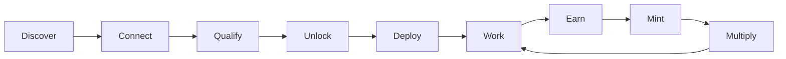
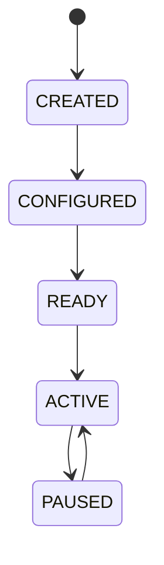
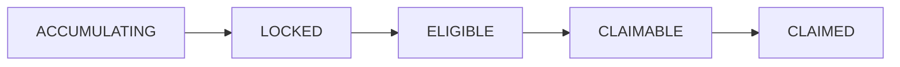

<div align="center">

# 🌸 Bloom Terminal

**Build your terminal. Deploy your agent. Put it to work.**

An onchain market intelligence and agent platform for the tokenized-equity ecosystem.

`Status: Concept / Pre-MVP` · `Docs: Product + Technical Spec`

</div>

---

## Overview

Bloom Terminal replaces the usual NFT launch flow (*connect wallet → follow on X → mint*) with an interactive, terminal-style experience that feels more like a personal financial operating system than a mint page.

Users:

1. Sign in with **X** and connect a **wallet**
2. Complete **missions** and build a small network of verified **agents**
3. Unlock a personal **worker**, choose its class and market focus
4. **Deploy** it to accumulate **Bloom rewards**
5. **Mint** the Bloom NFT to activate a **multiplier** and unlock claims

The terminal progressively unlocks as each requirement is met.

> **Core principle:** The NFT enhances an existing system — it is not the only reason the system exists. Without the NFT, users can still build and run a worker. With it, their terminal becomes more productive.

---

## Table of Contents

- [Core Concept](#core-concept)
- [User Journey](#user-journey)
- [Identity & Wallet Binding](#identity--wallet-binding)
- [Whitelist & Missions](#whitelist--missions)
- [Agent Network (Referrals)](#agent-network-referrals)
- [Terminal Eligibility](#terminal-eligibility)
- [Workforce](#workforce)
- [Rewards](#rewards)
- [NFT Utility](#nft-utility)
- [Terminal Dashboard](#terminal-dashboard)
- [User States](#user-states)
- [Architecture](#architecture)
- [Data Model](#data-model)
- [Anti-Abuse](#anti-abuse)
- [Design Direction](#design-direction)
- [MVP Scope](#mvp-scope)
- [Roadmap](#roadmap)
- [Open Questions](#open-questions)

---

## Core Concept

| Component | Role |
|---|---|
| **Terminal** | The user's personal Bloom interface — status, progress, workers, rewards |
| **Agents** | Verified participants a user brings in during whitelist onboarding |
| **Workers** | User-owned, configured units deployed to a market to generate rewards |
| **Market** | Tokenized-market assets or categories that workers focus on |
| **NFT** | Access and multiplier layer for the user's terminal economy |

```
                 BLOOM TERMINAL
                       │
          ┌────────────┼────────────┐
        MARKET       AGENTS /     REWARDS
         DATA        WORKERS
          └────────────┼────────────┘
                       │
                   BLOOM NFT
                       │
                  MULTIPLIER
```

### Core loop



---

## User Journey

```
Visit Bloom → Sign in with X → Connect wallet → Complete missions
→ Invite agents → Agents activate → Wallet eligible → Worker unlocked
→ Configure worker (name / class / market) → Deploy → Accumulate Bloom
→ Mint NFT → Multiplier activates → Claim rewards
```

<details>
<summary><strong>Screen-by-screen example flow</strong></summary>

| # | Screen | Key UI |
|---|---|---|
| 01 | Entry | `BLOOM TERMINAL — ACCESS THE MARKET.` `[ ENTER TERMINAL ]` |
| 02 | Authentication | `[ CONNECT X ]` |
| 03 | Wallet | `⚠ NOT CONNECTED` `[ CONNECT WALLET ]` |
| 04 | Missions | `APPLICATION PROGRESS ████████░░░░ 67%` + checklist |
| 05 | Network | `AGENT NETWORK 1 / 2 ACTIVE` `[ INVITE AGENT ]` |
| 06 | Eligibility | `TERMINAL ACCESS ✓ APPROVED` `[ ENTER WORKFORCE ]` |
| 07 | Worker creation | Name → Class → Market → `[ DEPLOY ]` |
| 08 | Activation | `ORION ● ACTIVE — BLOOM GENERATED +18.42` |
| 09 | Return visit | Balance grown, `NFT NOT MINTED`, `CLAIM LOCKED` |
| 10 | Mint | `MULTIPLIER 1.25×`, pre-mint rewards `CLAIMABLE` `[ CLAIM REWARDS ]` |

</details>

---

## Identity & Wallet Binding

Social and onchain identity are kept separate, then bound.

| Identity | Auth | Used for |
|---|---|---|
| **Social** | X OAuth | Profile, username, avatar, social missions, referral identity, anti-abuse signals |
| **Onchain** | Wallet signature | Eligibility, worker ownership, reward allocation, NFT ownership, claims |

```
X Account (x_user_id)
   └── Wallet
         ├── Eligibility
         ├── Worker
         ├── Rewards
         └── NFT
```

The terminal must always show whether the wallet is successfully bound.

---

## Whitelist & Missions

The whitelist is an application process, not a static address list. Missions are **modular** — they can be added, removed, or scheduled from the backend without frontend rebuilds.

| Type | Examples |
|---|---|
| **Social** | Follow Bloom, like, repost, quote, comment |
| **Onchain** | Connect / bind wallet, complete an onchain action, hold a required asset |
| **Network** | Invite users, activate agents |
| **Terminal** | Configure worker, select market, deploy worker |

---

## Agent Network (Referrals)

Referrals are framed as an agent network: not *"Invite 2 friends"* but **"Deploy 2 agents to activate your terminal."**

Each user gets a unique link, e.g. `https://bloomterminal.xyz/join/BISHOP`. The backend tracks `referrer → invite → X account → wallet → eligibility`.

### Agent statuses

| Status | Meaning |
|---|---|
| `INVITED` | Link generated / used, no auth yet |
| `CONNECTED` | Authenticated with X |
| `WALLET_PENDING` | X connected, wallet not bound |
| `ACTIVE` | Completed onboarding requirements |
| `ELIGIBLE` | Counts toward the inviter's terminal |

A referral only counts once the invited user reaches `ELIGIBLE`. Inviters see blockers immediately:

```
👤 @mike   ⚠ WALLET REQUIRED
Action Required — wallet binding incomplete.
```

---

## Terminal Eligibility

Eligibility is computed from all requirements, and the UI always explains what is missing.

```
X ACCOUNT        ✓
WALLET           ✓
MISSIONS         ✓
ACTIVE AGENTS    1 / 2
───────────────────
TERMINAL LOCKED
Missing: ○ Agent 2 is not active   [ VIEW AGENT ]
```

---

## Workforce

Eligibility unlocks the **Workforce** section, where users create and manage workers. A worker is a persistent, user-owned configuration with a defined function.

### Creation flow

1. **Name** — e.g. `ORION`
2. **Class** — see below
3. **Market** — category, then asset
4. **Confirm** — ⚠ class and primary market are **permanent** after deployment

Permanence gives workers identity and stops users from constantly switching to whatever is currently optimal.

### Worker classes

| Class | Identity | Focus |
|---|---|---|
| **Scout** | The explorer | New assets, emerging activity, new tokenized listings |
| **Analyst** | The researcher | Price history, volume, trends, asset performance |
| **Momentum** | The signal hunter | Large moves, volume spikes, acceleration |
| **Sentinel** | The guardian | Watchlists, price changes, events, alerts |

### Market selection

Categories: `TECHNOLOGY` · `AI` · `FINTECH` · `AUTOMOTIVE` · `CRYPTO` · `CONSUMER`
Assets (example): `NVDA` `AAPL` `GOOGL` `MSFT` `AMZN`

> The supported asset list depends on available tokenized-market infrastructure.

### Lifecycle



Paused workers never disappear — their history stays visible.

---

## Rewards

Workers accrue Bloom based on their function and eligible activity. Users should always see: current balance, accrual rate, worker contribution, multiplier, deployment duration, and locked vs. claimable balance.

### Formula (conceptual)

```
Final Reward = Base Output × Worker Modifier × NFT Modifier × Eligible Bonuses

Example:  100 × 1.10 × 1.25 = 137.5 BLOOM
```

All economic parameters are backend-configurable. The final formula is defined separately from the interface.

### Pre-mint accrual & claims

Users can start earning **before** mint. Balances grow but stay locked until the user holds a Bloom NFT.



Before claiming, the backend verifies:

1. User identity
2. Wallet ownership
3. NFT ownership
4. Reward balance
5. Claim status (no double claims)
6. Signature / transaction validity

---

## NFT Utility

| | Multiplier |
|---|---|
| No NFT | `1.00×` |
| Bloom NFT | `1.25×` |

Potential trait-driven utility: higher multipliers, extra worker slots, worker capacity, market access, agent efficiency, special worker abilities, terminal cosmetics.

---

## Terminal Dashboard

Panels on the main dashboard:

| Panel | Contents |
|---|---|
| **Markets** | Tokenized asset prices and % change |
| **Movers** | Top gainers / losers |
| **Worker** | Name, class, status, market, output |
| **Network** | Agents and active count |
| **Rewards** | Available, multiplier, claimable |

```
╔══════════════════════════════════════════╗
║ BLOOM TERMINAL                  09:42:18 ║
╠══════════════════════════════════════════╣
║ @username                    ● ONLINE    ║
║ X ACCOUNT        ✓ CONNECTED             ║
║ WALLET           ✓ CONNECTED             ║
║ AGENTS           2 / 2                   ║
║ ELIGIBILITY      ✓ CONFIRMED             ║
║ ──────────────────────────────────────── ║
║ WORKER   ORION · SCOUT · ● ACTIVE        ║
║ BLOOM BALANCE    2,481.32                ║
╚══════════════════════════════════════════╝
```

---

## User States

The frontend should treat these as explicit states:

| # | State | Terminal shows |
|---|---|---|
| 1 | Visitor | Public interface |
| 2 | X connected | Wallet not connected |
| 3 | Wallet connected | Eligibility pending |
| 4 | Missions incomplete | `3 / 5 COMPLETE` |
| 5 | Agents incomplete | `1 / 2 ACTIVE` |
| 6 | Eligible | Workforce unlocked |
| 7 | Worker created | Ready to deploy |
| 8 | Worker active | Rewards accumulating |
| 9 | NFT minted | Multiplier active, claims open |

---

## Architecture

```
                     FRONTEND (Bloom Terminal)
                              │
          ┌───────────────────┼───────────────────┐
     AUTH SERVICE        MISSION API        WALLET SERVICE
          │                   │                   │
        X API            TASK ENGINE              RPC
          └───────────────────┼───────────────────┘
                        BLOOM BACKEND
          ┌───────────────────┼───────────────────┐
     AGENT ENGINE       REWARD ENGINE        NFT ENGINE
          └───────────────────┼───────────────────┘
                           DATABASE
```

---

## Data Model

<details>
<summary><strong>Entities</strong></summary>

**User**
`id` · `x_user_id` · `x_username` · `x_profile_image` · `wallet_address` · `wallet_verified` · `eligibility_status` · `created_at` · `updated_at`

**Referral**
`id` · `referrer_id` · `referred_user_id` · `status` · `created_at` · `activated_at`

**Mission**
`id` · `title` · `description` · `type` · `requirement` · `reward` · `active` · `start_date` · `end_date`

**UserMission**
`user_id` · `mission_id` · `status` · `completed_at` · `verification_data`

**Worker**
`id` · `user_id` · `name` · `class` · `market` · `asset` · `status` · `created_at` · `deployed_at` · `paused_at`

**RewardAccount**
`user_id` · `base_balance` · `locked_balance` · `claimable_balance` · `multiplier` · `updated_at`

**NFT**
`token_id` · `owner` · `collection` · `multiplier` · `traits` · `minted_at`

</details>

---

## Anti-Abuse

Referrals plus rewards attract farming, so Sybil resistance is a first-class concern.

**Detect:** duplicate X accounts, suspicious wallet clusters, repeated wallet patterns, self-referrals, bot accounts, abnormally fast mission completion, referral farming.

**Signals:** X identity + wallet + referral graph + onchain history + session behavior.

No eligibility decision should rely on a single signal.

---

## Design Direction

> **Financial infrastructure meets onchain agent system.**

| ✅ Do | ❌ Avoid |
|---|---|
| Dark graphite / black base | Excessive neon or glow |
| Dense, clean information architecture | Generic Web3 gradients |
| Market-style tables, green/red indicators | Cluttered dashboards |
| Subtle cyan / amber accents | Over-the-top sci-fi UI |
| Grid layouts, terminal panels | Unnecessary 3D |
| Minimal animation, micro-interactions, sparing CRT touches | |

---

## MVP Scope

| Milestone | Deliverables |
|---|---|
| **MVP 1 — Terminal** | Landing page, terminal UI, X auth, wallet connect, profile, eligibility dashboard |
| **MVP 2 — Whitelist** | Missions + verification, referral links, agent network, eligibility engine |
| **MVP 3 — Workforce** | Worker creation, naming, class & market selection, deploy, status |
| **MVP 4 — Rewards** | Accrual, reward dashboard, locked balances, NFT verification, claims |
| **MVP 5 — NFT** | Mint integration, ownership verification, multiplier, claim activation |

---

## Roadmap

| Phase | Focus | Loop |
|---|---|---|
| 1 | Terminal | X + Wallet + Missions + Network |
| 2 | Workforce | Create → Configure → Deploy |
| 3 | Rewards | Work → Accumulate → Unlock → Claim |
| 4 | NFT | Mint → Activate → Multiply |
| 5 | Market Intelligence | Watch → Analyze → Alert → Act |
| 6 | Agent Economy | Agent → Experience → Reputation → Specialization → Marketplace |

### Future features

- **Multiple workers** per terminal
- **Worker levels** with efficiency bonuses
- **Worker reputation** from uptime, accuracy, and completed tasks
- **Market intelligence:** price/volume alerts, summaries, new-listing alerts, watchlists, heatmaps
- **Agent marketplace** for user-built specialized agents

---

## Open Questions

Items to settle before or during the technical spec:

- [ ] **What does a worker actually compute?** Define the "unit" of base output (time deployed, tasks completed, signals produced) so rewards aren't purely time-based.
- [ ] **Reward formula & emissions** — caps, decay, and total supply of Bloom.
- [ ] **Tokenized-asset data source** — which provider/chain supplies prices for supported assets.
- [ ] **X verification method** — API-based checks vs. manual/attestation for likes, reposts, and comments (API access and rate limits affect this).
- [ ] **Pause/cancel rules** for workers and how they affect accrual.
- [ ] **Legal & regulatory review** — rewards tied to tokenized equities and NFT purchases may raise securities and jurisdiction questions; get counsel before launch.

---

## Positioning

Not *"a Robinhood watcher"* — the market watcher is one component.

> **Bloom Terminal is an onchain market intelligence platform where users deploy autonomous workers to monitor tokenized markets and earn Bloom rewards.**

*Your onchain market terminal, powered by agents.*

---

<div align="center">

**Build your terminal. Choose your agent. Put it to work. Watch it bloom.** 🌸

</div>
